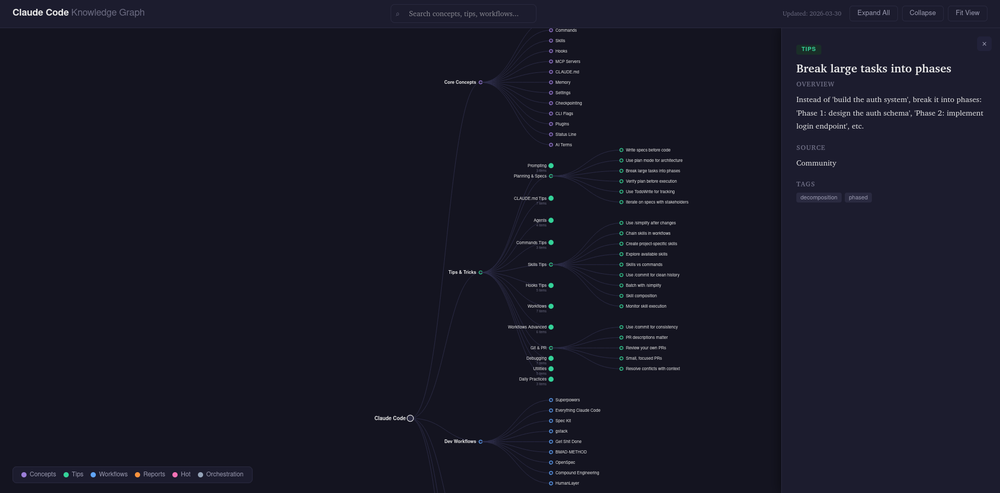

# Claude Code Knowledge Graph

An interactive horizontal tree visualization of Claude Code concepts, best practices, tips, and workflows.

**[Live Site](https://octokerbs.github.io/claude-code-knowledge/)**

## Screenshot

<!-- Add your screenshot here -->

## About

This project organizes the wealth of Claude Code knowledge into a navigable, visual graph. Instead of scrolling through long markdown files, you can explore concepts by clicking through an interactive tree — from broad categories down to specific tips and best practices.

All knowledge is based on [shanraisshan/claude-code-best-practice](https://github.com/shanraisshan/claude-code-best-practice), a community-curated repository of Claude Code tips, workflows, and reports.

## Features

- Horizontal tree graph with expand/collapse navigation
- Slide-in side panel with details, best practices, and examples
- Search across all concepts, tips, tags, and content
- Auto light/dark mode based on system preference
- Keyboard shortcuts: `/` search, `Esc` close, `F` fit view
- Weekly GitHub Action checks the source repo for updates

## Updating Content

The GitHub Action runs every Monday and opens a PR if new content is detected upstream. You can also run it manually:

```
gh workflow run update-content.yml
```

Or fetch locally:

```
./update.sh
```
